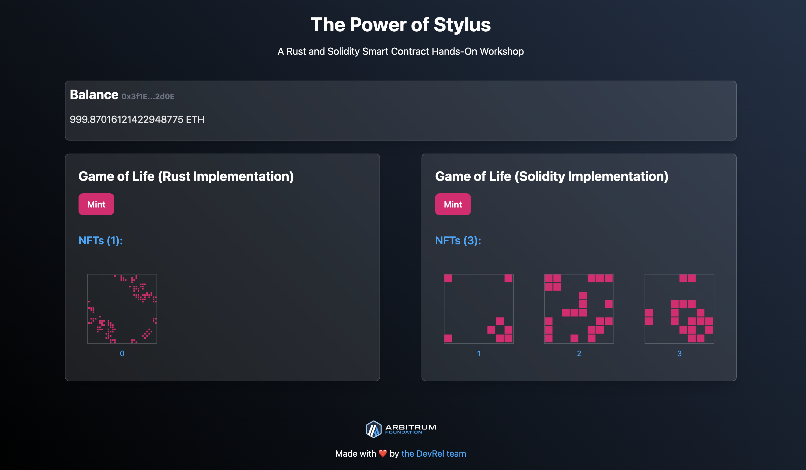

# The Power of Stylus: A Rust and Solidity Smart Contract Hands-On Workshop



## Welcome & Codespaces Quick Start

> **Run this workshop in GitHub Codespaces.** The Codespace devcontainer includes all dependencies and configurations. Click the button below to launch your Codespace and start building!

[](https://codespaces.new/ArbitrumFoundation/stylus-workshop-gol/tree/master)

**Quick Start:**
1. Click the "Open in Codespaces" button above.
2. Wait for your Codespace to initialize (this may take a minute).
3. Open a terminal in Codespaces (Terminal → New Terminal).
4. Follow the steps below. You do not need to install anything manually!

---

## What You'll Build

In this hands-on workshop, you will:
- Implement and compare smart contracts in both Rust (Stylus) and Solidity.
- Deploy them on a local Arbitrum Nitro devnode.
- Connect your contracts to a modern React frontend.
- Build a full dApp using the latest tools and best practices.

---


## Requirements

> **Skip this section if you use Codespaces!** The Codespace devcontainer already includes all tools.

For advanced/local setup:
- [pnpm](https://pnpm.io/installation)
- [nvm](https://github.com/nvm-sh/nvm#installing-and-updating)
- [rust](https://rustup.rs/)
- [foundry](https://book.getfoundry.sh/getting-started/installation)
- [Docker](https://www.docker.com/products/docker-desktop/)
- [Nitro-devnode](https://github.com/OffchainLabs/nitro-devnode?tab=readme-ov-file#usage)

## Project Structure

- `apps/frontend` – React/TypeScript frontend
- `apps/contracts-stylus` – Rust (Stylus) smart contracts
- `apps/contracts-solidity` – Solidity smart contracts
- `apps/nitro-devnode` – Local Arbitrum devnode

## Getting Started (in Codespaces)

Your Codespace comes pre-configured. Open a terminal and follow the steps in each section below. If you want to run locally, review the "Requirements" section above and follow these same steps in your own environment.

### Step 1: Start the Arbitrum Nitro Devnode
1. Open a new terminal window in Codespaces.
2. Start the Nitro devnode:
   ```sh
   pnpm --filter contracts-stylus nitro-node
   ```
   This will launch a local Arbitrum chain for deploying and testing your contracts.

### Step 2: Game of Life Stylus Contract
- `git checkout step-2-stylus-contract` — Switch to the Stylus contract step.
- `pnpm install -r` — Update dependencies.
- `cd apps/contracts-stylus && cargo stylus check` — Verify the Stylus contract.
- Edit `src/lib.rs` as instructed.

### Step 3: Frontend
- `git checkout step-3-frontend` — Switch to the frontend step.
- `pnpm install -r` — Update dependencies.
- `cd apps/contracts-stylus && cargo stylus check` — Verify contracts if needed.

### Step 4: Solidity Contract
- `git checkout step-4-solidity-contract` — Switch to the Solidity contract step.
- Review `src/NFT.sol`.
- `cd apps/contracts-stylus && cargo stylus check` — Verify contracts if needed.

### Step 5: Solidity + Stylus Contract
- `git checkout master` — Switch to the final result.
- `pnpm install -r` — Install all dependencies.
- Review `src/StylusNFT.sol`.
- `cd apps/contracts-stylus && cargo stylus check` — Verify contracts if needed.

## Workspace Shortcuts

Use these commands to run the project across different apps:

### Frontend
- `pnpm --filter frontend dev` — Start the development server.
- `pnpm --filter frontend build` — Build for production.
- `pnpm --filter frontend test` — Run tests.
- `pnpm --filter frontend lint` — Run linting.

Configure your wallet with these local network settings:
  - Name: Localhost-Nitro
  - RPC URL: http://localhost:8547 (or the externally available URL in Codespaces, see below)
  - Chain ID: 412346
  - Currency Symbol: ETH

> **Codespaces users:**
> When running the Nitro devnode inside Codespaces, you cannot connect to `localhost:8547` from your local machine or wallet directly. You must use the Codespaces port forwarding feature:
>
> 1. In your Codespace, click the "Ports" tab (usually at the bottom or side of the editor).
> 2. Find the forwarded port for `8547`.
> 3. Copy the "Local address" or "URL" provided by Codespaces (it will look like `https://<something>-8547.app.github.dev`).
> 4. Use this URL as the RPC URL in your wallet or in your frontend configuration.
>
> This ensures your wallet and dApp connect to the devnode running inside your Codespace.

## Funding and Using Test Wallets

> [!IMPORTANT]
> Use one wallet address to deploy contracts and a different wallet address to interact with them as a user. This separation simulates real-world scenarios and prevents issues such as being unable to mint NFTs during testing. Additionally, keep the deployer key separate from user/browser wallets and avoid importing it into browser extensions to prevent transaction failures or unexpected behavior due to nonce reuse.

### Preloaded Accounts

Nitro comes with the following preloaded account:

- **Deployer (Master Account):**
  - Address: `0x3f1Eae7D46d88F08fc2F8ed27FCb2AB183EB2d0E`
  - Private Key: `0xb6b15c8cb491557369f3c7d2c287b053eb229daa9c22138887752191c9520659`
  - Use this account to deploy contracts.

### Funding User Wallets

Interact with the contracts as a user by choosing a different wallet address from the deployer. Use one of the test accounts below, each with a unique address and private key.

Fund these accounts with ETH from the deployer (master) account using the following pnpm script:

```sh
pnpm --filter contracts-stylus fund-accounts
```

This script sends ETH from the master account to each test account so you can complete transactions during the workshop.

#### Test Accounts

- (0) 0xf39Fd6e51aad88F6F4ce6aB8827279cffFb92266 (1 ETH)
- (1) 0x70997970C51812dc3A010C7d01b50e0d17dc79C8 (1 ETH)
- (2) 0x3C44CdDdB6a900fa2b585dd299e03d12FA4293BC (1 ETH)
- (3) 0x90F79bf6EB2c4f870365E785982E1f101E93b906 (1 ETH)
- (4) 0x15d34AAf54267DB7D7c367839AAf71A00a2C6A65 (1 ETH)
- (5) 0x9965507D1a55bcC2695C58ba16FB37d819B0A4dc (1 ETH)
- (6) 0x976EA74026E726554dB657fA54763abd0C3a0aa9 (1 ETH)
- (7) 0x14dC79964da2C08b23698B3D3cc7Ca32193d9955 (1 ETH)
- (8) 0x23618e81E3f5cdF7f54C3d65f7FBc0aBf5B21E8f (1 ETH)
- (9) 0xa0Ee7A142d267C1f36714E4a8F75612F20a79720 (1 ETH)

**Testing Private Keys:**  
*(For local development only! Never use these on mainnet.)*

- (0) 0xac0974bec39a17e36ba4a6b4d238ff944bacb478cbed5efcae784d7bf4f2ff80
- (1) 0x59c6995e998f97a5a0044966f0945389dc9e86dae88c7a8412f4603b6b78690d
- (2) 0x5de4111afa1a4b94908f83103eb1f1706367c2e68ca870fc3fb9a804cdab365a
- (3) 0x7c852118294e51e653712a81e05800f419141751be58f605c371e15141b007a6
- (4) 0x47e179ec197488593b187f80a00eb0da91f1b9d0b13f8733639f19c30a34926a
- (5) 0x8b3a350cf5c34c9194ca85829a2df0ec3153be0318b5e2d3348e872092edffba
- (6) 0x92db14e403b83dfe3df233f83dfa3a0d7096f21ca9b0d6d6b8d88b2b4ec1564e
- (7) 0x4bbbf85ce3377467afe5d46f804f221813b2bb87f24d81f60f1fcdbf7cbf4356
- (8) 0xdbda1821b80551c9d65939329250298aa3472ba22feea921c0cf5d620ea67b97
- (9) 0x2a871d0798f97d79848a013d4936a73bf4cc922c825d33c1cf7073dff6d409c6

**Notice: Do not use these keys in production or put funds in them. They are for testing purposes only.**

### How to Use

1. Deploy contracts using the master account.
2. Interact with contracts (e.g., mint NFTs, call functions) using one of the funded test accounts.
3. Switch wallets in your web3 wallet (e.g., MetaMask) as needed.

> **Tip:** Keep deployer and user accounts separate to better understand contract permissions and simulate real dApp usage.

### Contracts
Before you run contract commands, start a local Ethereum node:
- Clone the devnode: `git clone https://github.com/OffchainLabs/nitro-devnode.git apps/nitro-devnode`
  - **Codespaces users:** This is handled by the Codespace devcontainer. You don't need to run this command.
- Start the Nitro node: `./apps/nitro-devnode/run-dev-node.sh`

After starting the node, run these commands:
- `pnpm --filter contracts-stylus check` — Verify and compile the contract.
- `pnpm --filter contracts-stylus test` — Run the contract tests.
- `pnpm --filter contracts-stylus test:integration` — Run contract integration tests.
- `pnpm --filter contracts-stylus deploy:local` — Deploy the contract to the local network.

### Contracts-solidity
- `pnpm --filter contracts-solidity build` — Build the contracts.
- `pnpm --filter contracts-solidity test` — Run the tests.
- `pnpm --filter contracts-solidity deploy:local` — Deploy the contract to the local network.